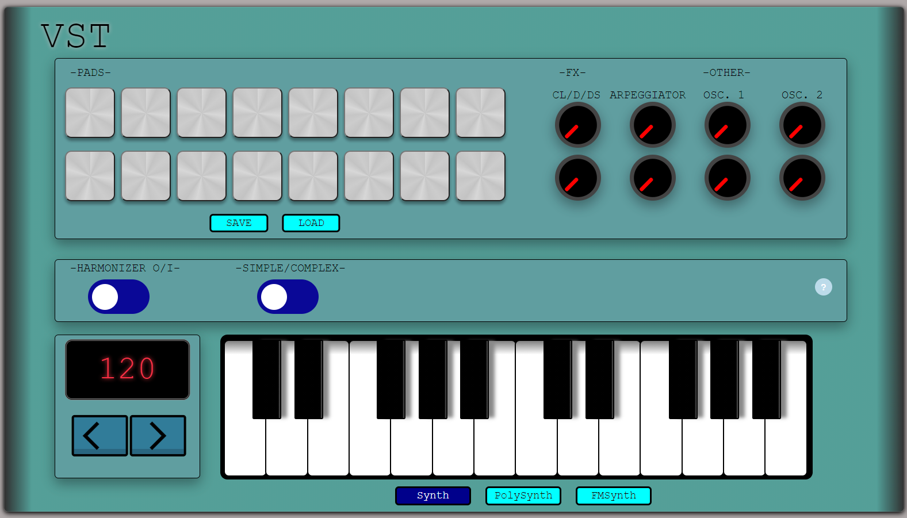
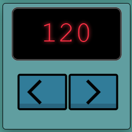
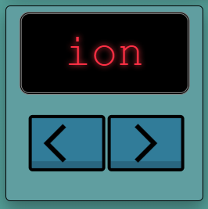
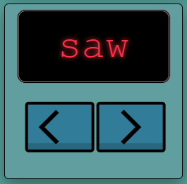
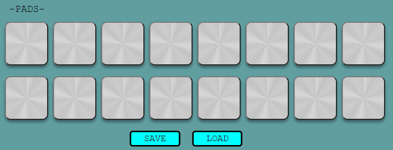
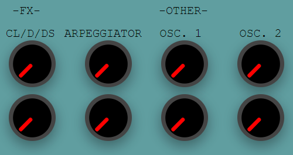
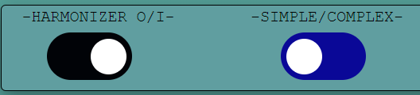

You can run our VST at this [link](https://actamproject.github.io/). (Open with the Google Chrome-webbrowser since the project is tested in Chrome, in other webbrowsers errors might occur). Due to the library Tone.js (after the chrome update), in order to start the audio context it is necessary to click on a knob.

# VST
Our purpose is to create a vst (using ```html```, ```css``` and ```javascript```) that allows to choose different synth sounds through effects knobs and play with them using the keyboard on the screen or using a MIDI keyboard. Moreover there are 16 pads with pre-loaded sounds, the preset of selected pads can be saved in cloud (we used [Cloud Firestore](https://firebase.google.com/products/firestore?gclid=CjwKCAjw1JeJBhB9EiwAV612y6I4eJLIuMd3jONgFK6B5ltIM7CL4E5UIwljjJHL0GYHEA8UY4T1gxoCjq4QAvD_BwE&gclsrc=aw.ds). Then the sound can be harmonized in different ways according to the scale the user is playing with. We used [Tone.js](https://tonejs.github.io/) for the synths and their effects.  
<p align="center">
  
</p>

## Display
The display has multiple functions: 
1. showing the BPM of the sound samples of the pads 
<p align="center">
  
</p>

  2. showing the scale that the user is playing 
  <p align="center">
  
</p>

  3. showing the type of wave that the oscillator are creating 
  <p align="center">
  
</p>

(1) The initial samples of the pads are set in 120 BPM, by using the left and right button the BPM of the sounds can be decreased (BPM - 1) or increased (BPM + 1). The BPM is only shown when the harmonizer is inactive (*Harmonizer I/O* button is blue). The functions to show and not show the BPM on the display are ```setBpm``` and ```setNoBpm```. \
(2) The played scale is shown when the harmonizer is active (*Harmonizer I/O* button is black). The available scales are: _ionian, dorian, phrygian, lydian, mixolydian, aeolian, locrian_. By playing a chord on the lower half of a MIDI keyboard, plugged in MIDI device required, the scale type will be displayed. Further information about the harmonizer and the scales can be found in the **Harmonizer** section below. \
(3) Clicking on the upper knob of both oscillators it is possible to change it into 3 positions (left, up, right), that mean a sine, saw, or square wave is created.

## Keyboard
<p align="center">
  
</p>

The white and black keys simulate the upper part of a Western Music scaled keyboard. The sounds of the keys are generated with the Tone.js library, which is a library that contains different sounds and effects. The lower key is then related to a C4 frequency and the last key to a B4. The keys can be played with the mouse by clicking on the keys or by playing the keys of a device that supports MIDI. Three type of key sounds can be selected, the three options are ```Mono Synth```, ```Poly Synth``` and ```FM Synth``` (```Tone.Synth```, ```Tone.PolySynth(Tone.AMSynth)``` and ```FMSynth```). The keys can be selected by pressing the buttons located below the keyboard. 

## MIDI
With the Web MIDI API it is possible to connect and use a MIDI device with the project. The ```WebMidi``` object makes it easy to send outgoing MIDI messages and to react to incoming MIDI messages. ```WebMidi.enable``` enables a MIDI device to connect, the console shows if WebMidi is enabled or disabled. It is possible to play tones that are out of the range of the keyboard of the VST. Another feature implemented is detecting and harmonizing chords that are played on the lower part of the keyboard, from B3 and below. The type of scale will be shown on the display and harmonized with one or two tones. See the [Harmonizer](#harmonizer) section below for further information. ```playNoteMIDI``` and ```stopnoteMIDI``` are functions to play and stop the keys sounds.

## Pads
<p align="center">
  
</p>

The audio of the pad samples in .wav form and are included in the folder: ```VST/Samples/rien samples```. The samples contain different kicks, hi-hats, snares created by us on an external DAW. All the samples have a BPM of 120 and the tempo can be changed using the left and right button below the display. ```render``` function let the samples play and pause.  The selection of the pads can be saved and loaded, read more in section **Cloud** below.

### Cloud
A set of selected pads can be saved. We used ```cloud firestore``` in order to save in the cloud the preset , this makes possible to save the present from one terminal and load to from another terminal (```load_model``` function). The preset can be saved pushing the 'save' button and can be loaded using the 'load' button that are under the pads.

## Knobs
<p align="center">
  
</p>

The knobs are designed with the ```_input-knobs.js_``` library; simple knobs, sliders, toggle switch can be made with this library. The parameters used are ```type```, ```range```, ```step``` and ```size```. The knobs are connected with four different features such as ```Clean```/```Delay```/```Distortion```, an ```arpeggiator``` and two ```oscillators```. The effects are connected to the key sounds of the keyboard. The function of each knob is explained in the following sections.

### Effects: Clean/Delay/Distortion (CL/D/DS)
The two knobs under ```"CL/D/DS"``` are to used for selecting the different effect presets wanted while playing the synths.
The knobs are to be used with a click (they work properly if you click on them, instead of twsting) and they have 3 positions: 0/Left, 50/Up, 100/Right.
The first position of the first knob is the ```CLEAN``` channel, where the synths are directly connected to the output, so the sound is not altered from the source. 
The second position corresponds to a ```PING-PONG DELAY``` which is added to the original source sound.
The third position is the ```DISTORTION``` channel.
The second knob has the same three position with the same 3 presets, but there is an additional low-pass filter, with a cut-off frequency of 920 Hz. ```Tone.Filter(920, "lowpass"```)
The effect-blocks all come from the Tone.js library.
Everytime that one of these two knobs is clicked, the block where the sounds of all the synths merge is disconnected from the output and from the previous effects (if any), and immediately reconnected forming the new desired configuration. 

### Arpeggiator
The arpeggiator has been done with the help of some Tone.js libraries; actually there is no real "arpeggiator" explained in the documentation, so the arpeggio was created using 4 scales (C4,D4,F4,G4), and looping them with the using of the knobs. 
To make the arpeggio we used the ```Tone.Pattern``` function, which helped us to make the loop without setting intervals, in a previous version using intervals we noticed that the arpeggio was lagging and so confusing, so this version is better. \
The arpeggio is also obtained by using ```synth.triggerAttackRelease``` function, to which we pass a note parameter and a duration between successive loops, 0.25, corresponding to a quarter note. 
_Tone.Pattern_ function takes two parameters, one is a function and the other is an array, that is one of the scales through which we are making the arpeggio.
The knobs through which the arpeggiator operates have three steps, one "clean", where the arpeggio is paused, one at half range and one at full range, covering two arpeggio scales; 
the first arpeggiator knob is controlled by the ```changeArpeggiator``` function, that takes as a parameter a generic event e, and is called through the "onclick" put on the html code of the knob. \
The second arpeggiator knob is controlled by the ```changeFrequency``` function, and it works in the same way as the previous function. 
In both cases, we used the ```playbackRate``` function of _Tone.Pattern_ to make the speed twice faster.
Arpeggiator is started with the ```pattern.start``` function and ```Tone.Transport.start``` function.  \
The scale used can be seen on the display. 

### Oscillators
We use two oscillators that work in the same way; actually we made the oscillators work in a strict different way since the "traditional" use in VSTs, where the oscillator is started by the keyboard and controlled with a knob. 
Here both the oscillators are controlled just by the knobs; the oscillator is obtained through the usage of some Tone.js libraries, expecially Tone.Oscillator, that is a pre-built oscillator that takes as parameters the frequency and the type of wave. 
In both cases, the higher knob is used to decide the type of wave(sine, saw, square), and the lower one to decide the range of frequency, high frequencies for the second lower knob and mid frequencies for the first lower knob. 
There are two main functions for both the oscillators, one is changeEventHandler, that is used to actually make the oscillator sound, and one is changeValueHandler, that is used to decide the type of wave that the user want to play. 
In the first function, we use a boolean starter to notice if the oscillator is already playing or not, with the two values (true and false) we can control the oscillator start and stop.
The duration of both oscillators is controlled in the function thorugh a setTimeout, set at 5 seconds to make the oscillator less disturbing possible. 
The frequency value can be seen on the display. 
In the second function, we previously take the value of the rotating knob, that has three steps, starting from 0 to 100, and for each knob there is a different kind of waveform selected by the user. 
The type of wave selected can be seen on the display. 

## Harmonizer
<p align="center">
  
</p>

The harmonizer recognizes the scale type (ionian,locryan,phrygian ...) from the chord played with the left hand on the MIDI keyboard and then harmonizes with different intervals (third up/down, fifth up/down, sixth ...) in accordance with the scale type selected. This feature can be activated switching the ```Harmonizer I/O``` button in the black position, also the complexity of the harmonizer can be choose from the user using the ```simple/complex``` button, when the button is in simple (blue position) the harmonizer add one tone to the one we are playing, while in complex mode (black position), two tones are added to the one the user is playng. The harmonizer can be used properly through a MIDI keyboard because the first 60 notes (from A0 to B3) are muted when the harmonizer is on, in this range of keys the user has to play the chord that defines the scale (the keys must be pressed at the same time), from the chord played in the proper half of the keyboard the function ```scaleTypeRecognition``` can recognise the scale type and the starting note of the scale.

#### Scale Recognition
At the launch of the application it is created a template matrix that contains all the 12x7 possible scales (each type of scale built starting from all the 12 notes), in order to create and manage this matrix we used an external library: [numjs](https://github.com/nicolaspanel/numjs), in order too add functionalities like NumPy. We created the matrix considering the rows as the template of the chord that identificate that single scale, the scales are defined by 1s and 0s depending on the presence of the note in that specific chord. For example, a C7maj chord (C,E,G,B) is defined as ```[1,0,0,0,1,0,0,1,0,0,0,1]```. The position of the notes are ```[C,C#,D,D#,E,F,F#,G,G#,A,A#,B]```.

##### Numjs
The functions used of this library are:
 - **nj.array**: create an array
 - **njvector.reshape**: change the dimensions of the njvector
 - **nj.concatenate**: concatenate the njelements (matrices\vectors)
 - **nj.zeros**: create a vector of zeros with the desired dimensions

##### Scale Chord
When the harmonizer is on and a note below A4 is played, the ```updateAddHarmVec``` function is called, the function add the note played in a vector and if the vector ```harmVec``` has more than 3 elements we search in the template matrix for the template of the scale that is more similar to the chord the user played, from which we know the mode of the scale and the scale's root note. When we release the key, the note of that key is removed from ```harmVec```, therefore the keys of the chord must be "down" at the same time in order to obtain the desired result. The chord recognition is made everytime a new key is pressed in the proper part of the keyboard and the length of *harmVec* is greater than 3.\
During the implementation the problem of the amniguity between chords of different scales arised, in other words playing the chords we got as result a different scale (usually with different root note) from the one we expected, this mismatch is due to the nature of the chords that can be seen as a discretization of a scale. Therefore, in order to overcome this problem, for some scales we set a the template chord of 5 notes, instead of the traditional 4 notes chord.
Hence, always considering C as the root note of the scale, the template chords used for each scale are: \
\


#### Harmonization
The harmonization is divided in ```Simple```, where we used one harmonizing note,  and ```Complex```, in which we used two armonizing notes. For each possible scale we choose different intervals to harmonize the note played; the choice of the intervals is based on our musical taste, as requested in the CMRM assignment. Therefore, the harmonization intervals are:
| Scale | First harm. | Second harm. |
| --- | :---: | :---: |
| Ionian | 5th | 7th |
| Dorian | 6th | 4th |
| Phrygian | 6th | 3rd |
| Lydian | 4th | 6th |
| Myxolydian | 6th | 7th |
| Aeolian | 6th | 3rd |
| Locrian | 4th | 6th |

The harmonization takes into account the distance between the harmonizing notes that can lead to dissonances, indeed the secondo harmonizing tune is raised by one octave. \
In the implementation, except for the _PolySynth_ that allows to play multiple notes at the same time, new synths are created, of the same type with the same effects of the one which is selected, that sound the harmonizing note once is calculated by the ```harmonicNotes``` funtion. In the same way, when a key is released, the respective synths are released, instead, for _PolySynth_ the harmonic notes are calculated once more in order to release that specific note.

